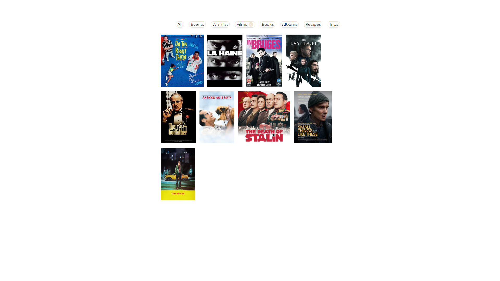
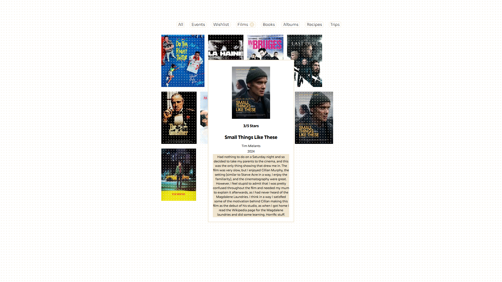

# Digital Scrapbook

## A digital-diary web app made with React and hosted on GitHub Pages

I wanted a creative outlet and to learn a new skill, so I learnt followed a Udemy course on React and made this. Think a comination, of LetterBoxd, Goodreads, and similar functionality for albums, recipes, trips and events. A bit self indulgent, but it's just for me and I like keeping a record of these things.

The live app can be found [here](https://owengraham.github.io/digital-scrapbook/)

### Main View 

### Extra Detail View

