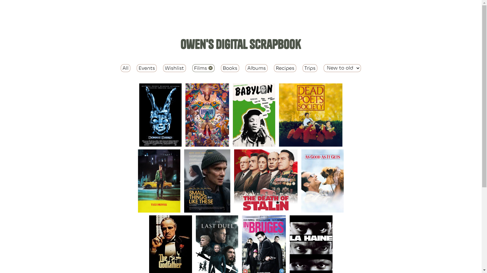
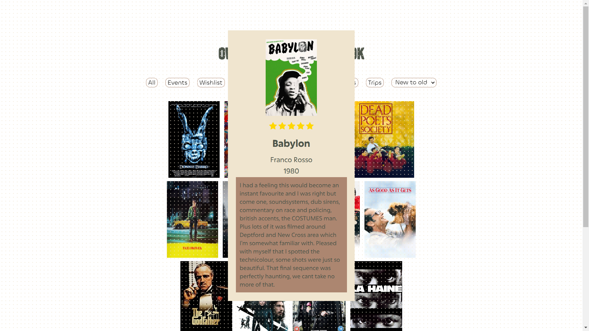
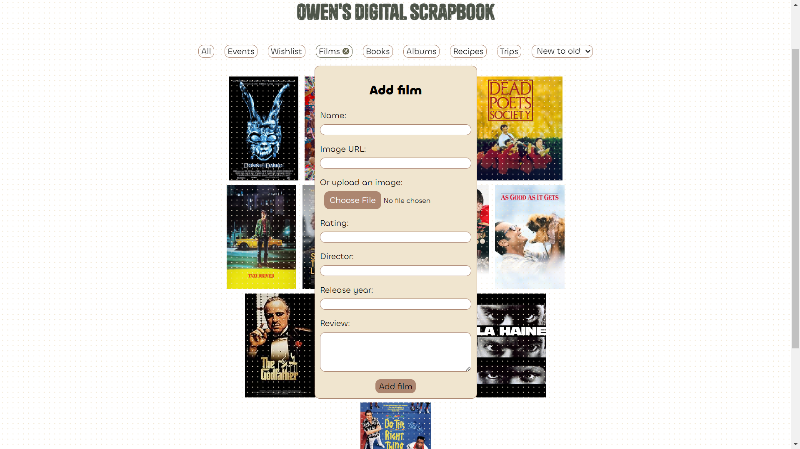

# Digital Scrapbook <!-- omit from toc -->

## A digital-diary web app made with React and Spring Boot <!-- omit from toc -->

I wanted a creative outlet and to learn a new skill, so I followed a Udemy course on React and made this. Think a combination of LetterBoxd, Goodreads, and similar functionality for albums, recipes, trips and events. A bit self indulgent, but it's just for me and I like keeping a record of these things.

A demo version of the app with read-only functionality is hosted on GitHub pages and can be found [here](https://owengraham.github.io/digital-scrapbook/)

## Table of Contents <!-- omit from toc -->

- [Summary](#summary)
- [Tech Stack](#tech-stack)
- [Testing Frameworks](#testing-frameworks)
- [Features](#features)
- [Screenshots](#screenshots)
  - [Main View](#main-view)
  - [Extra Detail View](#extra-detail-view)
  - [Add Scrap Form](#add-scrap-form)
- [Prerequisites](#prerequisites)
- [Installation](#installation)
  - [For the Backend](#for-the-backend)
  - [For the Frontend](#for-the-frontend)
- [Usage](#usage)
- [API Documentation](#api-documentation)
  - [Endpoints](#endpoints)
  - [Example Request](#example-request)
- [Contact Information](#contact-information)

## Summary

Digital Scrapbook is a web application that allows users to create and manage digital scraps for various categories such as films, books, albums, recipes, trips, and events. Users can add, view, and filter scraps, as well as upload images for each scrap. The application is built using modern web technologies and follows best practices for development and testing.

## Tech Stack

- **Frontend**: React, HTML, CSS
- **Backend**: Spring Boot, Java, Jackson
- **Build Tools**: Maven (for the backend), npm (for the frontend)
- **Deployment**: GitHub Pages (for the frontend demo)
- **CI/CD**: GitHub Actions

## Testing Frameworks

- **Frontend Testing**: Playwright
- **Backend Testing**: JUnit, Mockito, REST Assured

## Features

- Add and manage scraps for films, books, albums, recipes, trips, and events.
- Filter and sort scraps based on different criteria.
- Upload images for each scrap.
- Responsive design for mobile and desktop.

## Screenshots

### Main View



### Extra Detail View



### Add Scrap Form



## Prerequisites

- [JDK 23](https://www.oracle.com/uk/java/technologies/downloads/)
- [Node.js 22.11.0](https://nodejs.org/en/download/current)
- [Maven 3.9.9](https://maven.apache.org/download.cgi)

## Installation

To run the app locally, follow these steps:

1. Clone the repository:

```bash
git clone https://github.com/OwenGraham/digital-scrapbook.git
```

2. Navigate to the project directory:

```bash
cd digital-scrapbook
```

### For the Backend

3. Navigate to the backend directory:

```bash
cd backend
```

4. Build the project with Maven:

```bash
mvn clean install
```

5. Run the backend:

```bash
mvn spring-boot:run
```

### For the Frontend

6. Open the project in a new terminal and navigate to the frontend directory:

```bash
cd frontend
```

1. Install dependencies:

```bash
npm install
```

8. Start the development server:

```bash
npm start
```

## Usage

1. Open your browser and navigate to [http://localhost:3000](http://localhost:3000).
2. Use the app to add, view, and manage your digital scraps.

## API Documentation

### Endpoints

- `GET /api/scraps`: Fetch all scraps.
- `POST /api/scraps`: Add a new scrap.
- `POST /api/upload`: Upload an image.

### Example Request

```bash
curl -X POST http://localhost:8080/api/scraps \
-H "Content-Type: application/json" \
-d '{
    "type": "BOOK",
    "name": "Nineteen Eighty-four",
    "img": "http://example.com/image.jpg",
    "author": "George Orwell",
    "releaseYear": 1949,
    "rating": 3,
    "review": "Great book"
}'
```

## Contact Information

For any questions or suggestions, feel free to contact me at owen.graham@outlook.com.
